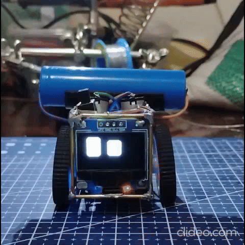

# ESP32 Emo Chan

Interactive robot based on ESP32-C3 with animated eye expressions on an OLED display. This robot responds to user interactions via buttons and displays various emotions and automatic movements.

[](asset/preview.mp4)

## Description

ESP32 Emo Chan is an interactive robot project using the ESP32-C3 as the main microcontroller. It features:

- **OLED Display (SSD1306)** - Displays robot eyes with smooth and expressive animations
- **DC Motors** - Moves the robot in various directions (forward, backward, left, right)
- **Buzzer** - Plays melodies and sounds
- **Button** - Interface for user interaction

The robot has a complex state machine system with various emotions and behaviors that change based on user interaction or idle time.

## Features

### Expressions & Emotions
- **Default** - Normal expression with auto-blink
- **Happy** - Happy expression with laughing animation
- **LongHappy** - Extended happy expression
- **Scared** - Scared expression with sweat effect
- **Scare** - Transition from scared
- **Curiosity** - Curious expression with moving eyes
- **Sleepy** - Sleepy expression
- **Asleep** - Robot falls asleep
- **Angry** - Angry expression

### Interaction
- **Single Click** - Triggers a happy or angry expression randomly
- **4x Click** - Triggers scared expression
- **Long Press** - Triggers long happy expression
- **Long Press Release** - Returns to happy expression

### Automatic Behavior
- Random motor movement when idle
- Automatic state transitions based on time
- Auto-blink for eyes
- Smooth and responsive eye animations

## Hardware Requirements

### Main Components
- **ESP32-C3 DevKitM-1** - Main microcontroller
- **OLED Display SSD1306** (128x64) - Display for robot eyes
- **Motor Driver** (L298N or similar) - Driver for DC motors
- **2x DC Motors** - Motors for robot movement
- **Buzzer** - Speaker for sound
- **Button** - Interaction button
- **Resistor** - For pull-up button (if needed)

### Pin Connections

| Component | ESP32-C3 Pin |
|-----------|--------------|
| I2C SDA   | GPIO 6       |
| I2C SCL   | GPIO 7       |
| Buzzer    | GPIO 8       |
| Button    | GPIO 10      |
| Motor IN1 | GPIO 0       |
| Motor IN2 | GPIO 1       |
| Motor IN3 | GPIO 2       |
| Motor IN4 | GPIO 3       |

## Installation

### Prerequisites
- [PlatformIO](https://platformio.org/) installed
- USB cable for upload and monitoring

### Installation Steps

1. **Clone repository**
```bash
git clone <repository-url>
cd pet_robot
```

2. **Install dependencies**
```bash
pio lib install
```

3. **Upload to ESP32-C3**
```bash
pio run -t upload
```

4. **Serial Monitor** (optional)
```bash
pio device monitor
```

## Project Structure

```
pet_robot/
├── src/
│   ├── main.cpp              # Main program
│   └── lib/
│       ├── RobotPet.h        # Main robot class with state machine
│       ├── MotorManager.h    # Class for motor control
│       ├── MotorManager.cpp
│       ├── ButtonManager.h   # Class for handling button input
│       ├── ButtonManager.cpp
│       ├── SoundPlayer.h     # Class for playing melodies
│       └── FluxGarage_RoboEyes.h  # Robot eye animation library
├── platformio.ini            # PlatformIO configuration
├── asset/
│   └── preview.mp4           # Robot preview video
└── README.md                 # This documentation
```

## Usage

### Initial Setup
1. Connect all components according to the pin mapping above
2. Upload the program to the ESP32-C3
3. The robot will automatically start with a startup melody and default expression

### Interacting with the Robot

- **Single Click** - The robot responds with a happy or angry expression randomly
- **4x Fast Clicks** - Robot shows a scared expression
- **Press and Hold** - Robot shows a long happy expression
- **Release after Long Press** - Robot returns to happy expression

### Automatic Behavior
- After 5 seconds of idle time, the robot enters curiosity or sleepy mode
- The robot moves randomly every few seconds while in default or curiosity mode
- After 10 seconds without interaction, the robot may fall asleep

## Configuration

You can change various parameters in `src/lib/RobotPet.h`:

```cpp
static const unsigned long IDLE_DELAY = 5000;        // Delay before idle (ms)
static const unsigned long DEEP_SLEEP_DELAY = 10000;  // Delay before sleep (ms)
static const unsigned long ANGRY_DURATION = 5000;    // Angry expression duration (ms)
static const unsigned long HAPPY_DURATION = 500;      // Happy expression duration (ms)
```

## Libraries Used

- **Adafruit SSD1306** (v2.5.15) - Driver for OLED display
- **Adafruit GFX** - Graphics library for drawing
- **FluxGarage RoboEyes** - Robot eye animation library (included)

## Troubleshooting

### Display not showing anything
- Check I2C connections (SDA/SCL)
- Ensure the display I2C address is 0x3C
- Run an I2C scanner to verify the connection

### Motor not moving
- Check motor driver connections
- Ensure sufficient power supply for motors
- Verify motor pins are connected correctly

### Button unresponsive
- Check button connection to GPIO 10
- Ensure the button uses pull-up (INPUT_PULLUP)
- Check debounce delay in ButtonManager
